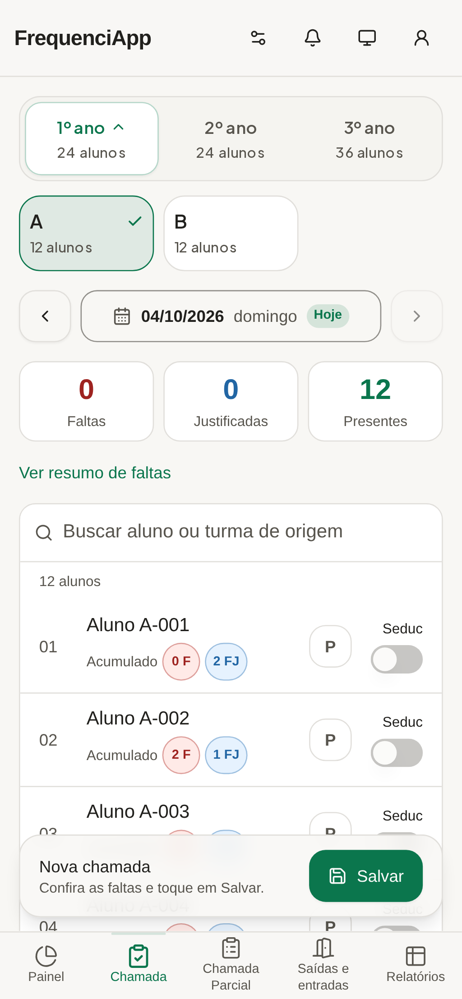
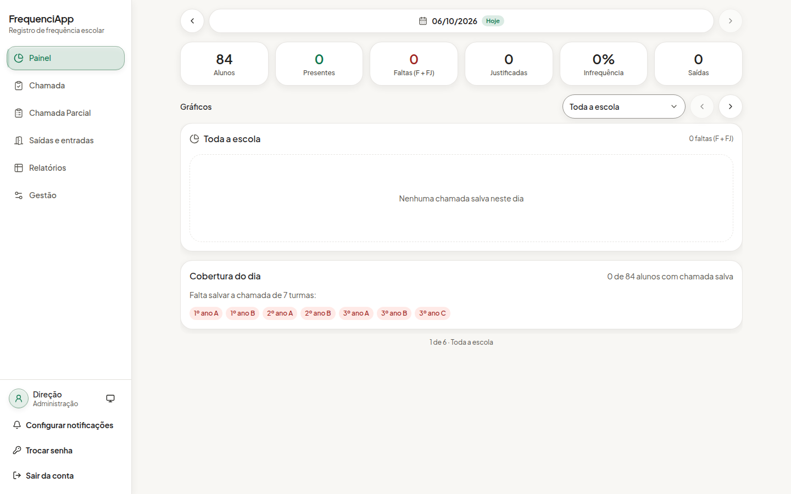
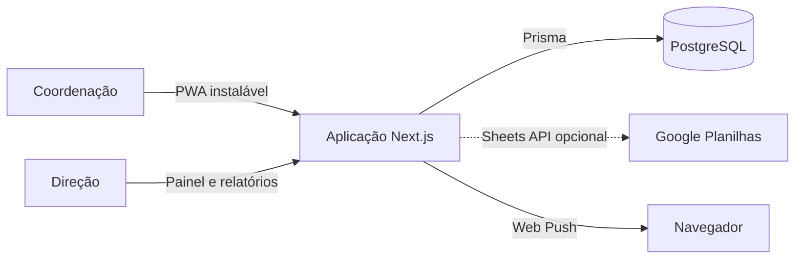

# FrequenciApp

[](https://github.com/eemtijca/frequenciapp/actions/workflows/qualidade.yml)
[](https://github.com/eemtijca/frequenciapp/actions/workflows/testes.yml)
[](https://github.com/eemtijca/frequenciapp/actions/workflows/codeql.yml)
[](LICENSE)

<picture>
  <source media="(prefers-color-scheme: dark)" srcset="docs/imagens/chamada-mobile-escuro.png">
  
</picture>

Aplicativo da coordenação escolar: chamada única diária, saídas antecipadas e indicadores da escola. Mobile-first, sem ruído e com o menor número de toques possível entre abrir o app e ter a chamada salva.

Aplicação publicada em https://frequenciappjca.vercel.app.

O fluxo segue a prática da coordenação: escolha a turma e o dia, todos começam presentes, toque apenas nos alunos que faltaram, escolha a justificativa quando houver e salve. O Painel mostra a infrequência do dia por série e por turma, a área Saídas e entradas registra quem saiu ou chegou mais tarde com justificativa e quem liberou, e os Relatórios reúnem histórico, grade por período e o resumo por aluno.

<details>
<summary>Sumário</summary>

- [Demonstração](#demonstração)
- [Recursos](#recursos)
- [Stack](#stack)
- [Pré-requisitos](#pré-requisitos)
- [Começando](#começando)
- [Como usar](#como-usar)
- [Configuração](#configuração)
- [Arquitetura](#arquitetura)
- [Testes e qualidade](#testes-e-qualidade)
- [Deploy](#deploy)
- [Privacidade](#privacidade)
- [Segurança](#segurança)
- [Roadmap](#roadmap)
- [Perguntas frequentes](#perguntas-frequentes)
- [Documentação](#documentação)
- [Contribuindo](#contribuindo)
- [Suporte](#suporte)
- [Créditos](#créditos)
- [Licença](#licença)

</details>

## Demonstração

A aplicação publicada fica em https://frequenciappjca.vercel.app. Para experimentar localmente com dados sintéticos, siga a seção [Começando](#começando): o Compose cria o administrador e a semente gera séries, turmas, alunos e alguns dias de chamadas e saídas.

<picture>
  <source media="(prefers-color-scheme: dark)" srcset="docs/imagens/painel-desktop-escuro.png">
  
</picture>

## Recursos

- **Chamada diária**: turmas por toque, data com navegação por setas, busca por nome, resumo ao vivo e salvamento com rascunho local. A falta pode receber um código de justificativa e vira FJ; o acumulado do aluno aparece na lista e no resumo de faltas.
- **Chamada Parcial**: registro independente por aluno e dia, com turno inteiro ou aulas frequentadas e chave manual "Registrado na Seduc". Correções reabrem a pendência; uma terceira planilha Google recebe os registros após prévia.
- **Entradas atrasadas**: a área Saídas e entradas registra data, horário e motivo da chegada, preservando a turma do registro e a chamada. Envio manual com prévia para aba própria pela Sheets API.
- **Saídas antecipadas**: registro separado da chamada, com momento (aulas, intervalos e almoço), justificativa (tipo do catálogo ou texto escrito), observação e quem libera escolhido em um catálogo da Gestão. A lista das saídas do dia, com remoção para correção, completa a área; o relatório por turma ou por aluno fica em Relatórios.
- **Painel do dia**: gráficos de infrequência por série e por turma, total de faltas (F + FJ), taxa de infrequência, cobertura das chamadas e turmas pendentes.
- **Relatórios**: histórico por mês com filtro de série, grade por turma de origem nos modos dia, semana de aula, período e mês, com a coluna acumulada, exportação CSV da turma de origem e relatório por aluno com faltas, justificadas e saídas.
- **Gestão pela administração**: séries, turmas, aulas, alunos e contas da equipe, mais as configurações de recursos, os catálogos de justificativas e de quem libera as saídas, e a cópia de segurança em JSON.
- **Configurações de recursos**: a chamada por aula (chips de aulas e marca S) fica disponível para quando for usada e desligada por padrão; a área de saídas antecipadas pode ser ocultada sem perder registros; os catálogos de justificativas e de quem libera as saídas são editáveis, em ordem alfabética, com código fixo e situação.
- **Proteção contra conflitos**: uma chamada por turma e dia, compartilhada pela coordenação; salvamentos de outro dispositivo são recusados com aviso em vez de sobrescrita silenciosa (controle por revisão em transação serializável).
- **PWA completo**: instala no dispositivo como aplicativo, abre em Chamada ou Painel pelos atalhos, avisa quando a internet cai e atualiza com um toque quando há versão nova.
- **Erros em português**: toda falha de banco ou de API vira mensagem curta e acionável, sem termo técnico.
- **Navegação por deslize**: troca de visões deslizando a tela com o dedo, com o indicador da barra inferior preso à rolagem quadro a quadro, navegação inferior no celular e barra lateral no desktop, com estado e rolagem preservados. Gestão fica no cabeçalho do celular, antes das notificações.
- **Tema do sistema, claro ou escuro**, animações discretas que respeitam a preferência de movimento reduzido e interface pensada para uma mão.
- **Google Planilhas opcional**: frequência, saídas e entradas e Chamada Parcial usam arquivos escolhidos com OAuth e Google Picker, pela Sheets API. A Chamada Parcial exige um terceiro arquivo separado. Há conferência do esquema, prévia obrigatória e releitura antes da escrita. Na frequência e nas saídas, o modo completo, com senha e prazo, permite corrigir divergências e remover apenas o que a integração criou. Não são criadas abas de backup. Consulte [as condições de escrita pela Sheets API](docs/planilha.md).

## Stack

- Next.js 16 (App Router) com TypeScript estrito.
- PostgreSQL 17 com Prisma ORM 7, conexão do runtime em `DATABASE_URL` e conexão do CLI em `DIRECT_URL`, com adaptador oficial `pg`.
- Autenticação própria: scrypt para senhas, sessões opacas em cookies HttpOnly e papéis de administração e coordenação.
- Transações ACID com isolamento serializável e repetição automática em conflitos.
- Tailwind CSS 4 com componentes shadcn/ui personalizados, animações com Motion e gráficos com Recharts.
- Service worker próprio para a experiência instalável e o aviso offline.
- Vitest para testes de unidade e contratos de API.

## Pré-requisitos

- Node.js 20.19 ou superior.
- Docker com Compose no modo recomendado.
- PostgreSQL 17 próprio, como alternativa ao Compose.

## Começando

```bash
cp .env.example .env
# Gere o segredo da sessão e cole no .env:
#   openssl rand -base64 32
docker compose up --build
```

O Compose sobe o PostgreSQL 17, aplica as migrações na partida e inicia o aplicativo em http://localhost:3000. O administrador inicial (primeiro usuário, acesso root de configuração) pode ser criado na partida: basta preencher `ADMIN_EMAIL`, `ADMIN_SENHA` e `ADMIN_NOME` no `.env`. O bootstrap não altera uma conta que já exista, então reiniciar o contêiner não regrava a senha. Para criar ou trocar a senha depois, rode o comando que sempre aplica os valores:

```bash
ADMIN_EMAIL=direcao@escola.br ADMIN_SENHA='uma senha forte' ADMIN_NOME='Direção' \
  docker compose exec app npm run criar-admin
```

Com o administrador no dispositivo, o restante (contas da equipe, séries, turmas, aulas e alunos) é configurado pela área de Gestão, sem comandos. Para experimentar com dados sintéticos (nenhum dado real de pessoa), crie também a conta de coordenação de demonstração e a semente:

```bash
CONTA_EMAIL=equipe@escola.br CONTA_SENHA='outra senha forte' CONTA_NOME='Equipe' \
  docker compose exec app npm run criar-coordenacao
SEED_ALUNOS=12 docker compose exec app npm run seed
```

Instruções sem Docker, variáveis de ambiente e demais detalhes em [docs/ambiente.md](docs/ambiente.md). Publicação em [docs/deploy.md](docs/deploy.md).

## Como usar

1. A administração cria as contas da equipe e configura séries, turmas, aulas e alunos.
2. A coordenação abre a Chamada, escolhe a turma e o dia e marca apenas os ausentes.
3. Saídas, entradas e a Chamada Parcial são registradas nas áreas próprias, com justificativa e autoria.
4. O Painel mostra a infrequência do dia, a cobertura das chamadas e as turmas pendentes.
5. Os Relatórios consolidam o histórico e permitem exportar a turma em CSV.
6. Opcionalmente, a escola conecta as planilhas Google para receber os registros.

## Configuração

As variáveis são validadas na partida. As principais:

| Variável        | Papel                                                                |
| --------------- | -------------------------------------------------------------------- |
| `DATABASE_URL`  | Conexão de runtime, com pooler de transação em ambientes serverless. |
| `DIRECT_URL`    | Conexão de sessão para CLI e migrações em banco gerenciado.          |
| `AUTH_SECRET`   | Segredo das sessões e da derivação do par de notificações.           |
| `TZ_APP`        | Fuso usado para resolver o dia corrente e os rótulos de datas.       |
| `PERMITIR_HTTP` | Aceita HTTP sem TLS em rede confiável; padrão `false`.               |
| `GOOGLE_*`      | Integração opcional com as planilhas pela Sheets API.                |
| `PUSH_VAPID_*`  | Par de chaves das notificações Web Push.                             |

A referência completa está em [docs/ambiente.md](docs/ambiente.md).

## Arquitetura

Aplicação Next.js única, com o aplicativo inteiro em `/` e as visões trocadas localmente. A integração com o Google é opcional e desligada por padrão.



As camadas, o fluxo de requisição e as decisões registradas estão em [docs/arquitetura.md](docs/arquitetura.md) e [docs/adr/](docs/adr/).

## Testes e qualidade

| Comando                   | Efeito                                                   |
| ------------------------- | -------------------------------------------------------- |
| `npm run format:check`    | Prettier em modo verificação.                            |
| `npm run lint`            | ESLint com regras estritas.                              |
| `npm run tsc`             | Verificação de tipos sem emissão.                        |
| `npm run test:unit`       | Testes de unidade e guarda editorial.                    |
| `npm run test:api`        | Contratos de API com o aplicativo no ar.                 |
| `npm run test:e2e:docker` | Ponta a ponta na imagem oficial, com o aplicativo no ar. |
| `npm run test:pwa:docker` | PWA contra o build de produção.                          |
| `npm run capturas:readme` | Regenera as capturas do README em `docs/imagens/`.       |

A convenção das suítes está em [docs/testes.md](docs/testes.md) e [tests/README.md](tests/README.md).

## Deploy

[](https://vercel.com/new/clone?repository-url=https%3A%2F%2Fgithub.com%2Feemtijca%2Ffrequenciapp&project-name=frequenciapp&repository-name=frequenciapp&env=DATABASE_URL,DIRECT_URL,AUTH_SECRET,TZ_APP,ADMIN_EMAIL,ADMIN_SENHA,ADMIN_NOME&envDescription=Vari%C3%A1veis%20do%20FrequenciApp%3A%20banco%2C%20segredo%20de%20sess%C3%A3o%2C%20fuso%20e%20administrador%20inicial&envLink=https%3A%2F%2Fgithub.com%2Feemtijca%2Ffrequenciapp%2Fblob%2Fmain%2Fdocs%2Fambiente.md)

O build da Vercel apenas gera o cliente Prisma; as migrações são aplicadas pelo workflow de migrações na `main` ou manualmente com `npm run db:deploy`. A agenda de notificações usa o `CRON_SECRET`. As demais formas de publicação estão em [docs/deploy.md](docs/deploy.md) e a implantação em AWS, Azure ou GCP com Terraform está em [docs/implantacao-nuvem.md](docs/implantacao-nuvem.md).

## Privacidade

O aplicativo registra cadastro escolar, frequência e os registros operacionais necessários, incluindo presença parcial e autoria da confirmação manual da Seduc. A integração opcional com Google Planilhas, desligada por padrão, envia os campos de cada finalidade aos arquivos escolhidos pela escola. A confirmação manual não transmite dados ao sistema da Seduc. O repositório não contém dados reais de pessoas; a semente de desenvolvimento usa apenas nomes sintéticos. Detalhes e orientações em [docs/lgpd.md](docs/lgpd.md).

## Segurança

Vulnerabilidades são reportadas em issue privada ou security advisory, nunca em issue pública. A autenticação usa scrypt e sessões opacas revogáveis, com cabeçalhos de segurança e verificação de origem. Os controles estão em [docs/seguranca.md](docs/seguranca.md) e a política de reporte em [SECURITY.md](SECURITY.md).

## Roadmap

As próximas mudanças são discutidas nas [issues do repositório](https://github.com/eemtijca/frequenciapp/issues) e registradas no [CHANGELOG.md](CHANGELOG.md).

## Perguntas frequentes

**O FrequenciApp é gratuito?**
Sim, é de código aberto sob licença MIT.

**Quem pode usar?**
A coordenação e a direção da escola. As contas são criadas pela administração, sem cadastro público.

**Funciona instalado no celular?**
Sim. O aplicativo é um PWA instalável, com atalhos para Chamada e Painel, aviso de conexão e atualização com um toque.

**A planilha Google é obrigatória?**
Não. A integração é opcional e desligada por padrão; sem ela, tudo funciona pelo aplicativo.

**Duas pessoas podem salvar a mesma chamada?**
A chamada é compartilhada pela coordenação. O salvamento de outro dispositivo é recusado com aviso, em vez de sobrescrever o registro.

**Onde reporto um problema?**
Em uma issue no GitHub. Vulnerabilidades seguem o [SECURITY.md](SECURITY.md).

## Documentação

| Documento                                                                                  | Conteúdo                                           |
| ------------------------------------------------------------------------------------------ | -------------------------------------------------- |
| [docs/arquitetura.md](docs/arquitetura.md)                                                 | Camadas, fluxo de requisição e organização.        |
| [docs/ambiente.md](docs/ambiente.md)                                                       | Variáveis de ambiente e execução local.            |
| [docs/banco.md](docs/banco.md)                                                             | Esquema, migrações e rotinas de banco.             |
| [docs/modelo-de-dados.md](docs/modelo-de-dados.md)                                         | Entidades e regras de frequência.                  |
| [docs/api.md](docs/api.md)                                                                 | Contratos das rotas HTTP.                          |
| [docs/interface.md](docs/interface.md)                                                     | Decisões de interface, movimento e acessibilidade. |
| [docs/planilha.md](docs/planilha.md)                                                       | Integração opcional com Google Planilhas.          |
| [docs/testes.md](docs/testes.md)                                                           | Suítes, convenções e cobertura.                    |
| [docs/deploy.md](docs/deploy.md)                                                           | Docker Compose, Vercel e outras formas.            |
| [docs/implantacao-nuvem.md](docs/implantacao-nuvem.md)                                     | AWS, Azure e GCP com Terraform.                    |
| [docs/seguranca.md](docs/seguranca.md)                                                     | Autenticação, sessões, CSRF, papéis e cabeçalhos.  |
| [docs/lgpd.md](docs/lgpd.md)                                                               | Dados tratados, minimização e direitos.            |
| [docs/operacao.md](docs/operacao.md)                                                       | Backup, restauração e rotinas do operador.         |
| [docs/adr/001-postgresql-com-prisma.md](docs/adr/001-postgresql-com-prisma.md) e seguintes | Decisões de arquitetura registradas.               |
| [CONTRIBUTING.md](CONTRIBUTING.md)                                                         | Como preparar o ambiente e propor mudanças.        |
| [SECURITY.md](SECURITY.md)                                                                 | Como reportar vulnerabilidades.                    |
| [CHANGELOG.md](CHANGELOG.md)                                                               | Histórico de mudanças do projeto.                  |

## Contribuindo

Leia o [CONTRIBUTING.md](CONTRIBUTING.md) antes de propor mudanças. Issues e pull requests usam etiquetas de tipo e de área, commits atômicos em um único pull request e abertura somente com o trabalho finalizado. Agentes de IA seguem o [AGENTS.md](AGENTS.md).

## Suporte

Dúvidas e problemas são bem-vindos nas [issues do repositório](https://github.com/eemtijca/frequenciapp/issues). Para vulnerabilidades, use o canal privado descrito no [SECURITY.md](SECURITY.md).

## Créditos

Projeto mantido pela equipe do FrequenciApp na EEMTI José Cláudio de Araújo.

## Licença

[MIT](LICENSE)
