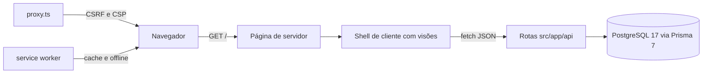
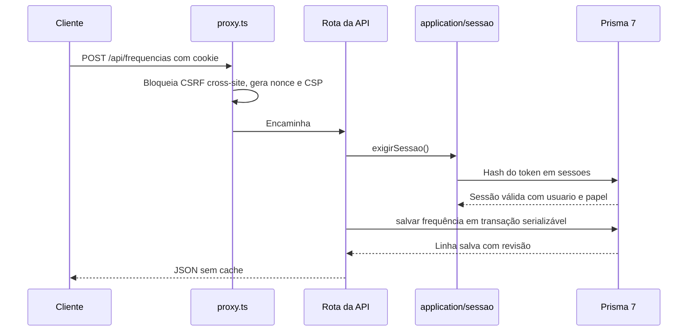

# Arquitetura

Next.js 16 (App Router) com TypeScript estrito sobre PostgreSQL 17 via Prisma 7 (adaptador `pg`). A aplicação é um único processo Node que serve a página do aplicativo, as rotas de API e o service worker. A coordenação registra uma frequência por turma e dia, compartilhada pela equipe, e a administração cuida das contas e dos cadastros.

## Visão geral

O navegador carrega `src/app/page.tsx`, um componente de servidor que resolve a sessão e pré-busca o escopo do usuário: séries, turmas visíveis, alunos e frequências do mês corrente. Sem sessão, a tela de entrada é renderizada no mesmo endereço. Com sessão, a página entrega ao shell de cliente o que cada papel pode ver; a partir daí o shell troca de visão localmente, sem recarregar, e as ações chamam rotas em `src/app/api/**`, que resolvem a sessão, aplicam as guardas de papel e respondem JSON. O service worker em `public/sw.js` cuida da instalação como PWA e da página de aviso quando a internet cai.



## Camadas

- `src/domain/`: regras puras, sem dependência de framework ou banco. `frequencia.ts` traz os tipos de série, turma, aula, aluno e frequência, a validação de calendário e de horário, a derivação da marca do aluno no dia e a montagem da grade por turma de origem; `usuarios.ts` traz a política de senha, os papéis e os rótulos de exibição. Tudo aqui é testável de forma isolada e é compartilhado entre servidor e cliente.
- `src/application/`: casos de uso. `frequencias.ts` carrega, lista e salva a frequência compartilhada com o controle de revisão em transação serializável; `alunos.ts`, `series.ts`, `turmas.ts`, `horarios.ts` e `usuarios.ts` gerenciam as entidades escolares e as contas; `sessao.ts` autentica, resolve a identidade e troca a própria senha. Validação de entrada com zod, decisões de negócio e mapeamento das linhas de banco para os tipos do domínio.
- `src/infra/`: integrações. `banco.ts` é o singleton do PrismaClient com o adaptador `pg`; `ambiente.ts` valida as variáveis com falha antecipada; `auth/` concentra hash de senha, sessões opacas e limitador de tentativas; `transacoes.ts` executa transações ACID com repetição automática; `erros.ts` traduz qualquer exceção para português claro; `http.ts` reúne os auxiliares comuns das rotas; `auditoria.ts` registra as ações administrativas.
- `src/app/` e `src/components/`: apresentação. A página única, as rotas de API como adaptadores finos dos casos de uso e os componentes de interface, com o conjunto shadcn/ui personalizado em `components/ui`, as animações com Motion e o registro da PWA.

A dependência aponta para dentro: apresentação chama aplicação, aplicação orquestra domínio e infraestrutura, domínio não importa nada. A infraestrutura conhece o Prisma; a aplicação não conhece HTTP.

## Fluxo de uma requisição autenticada



## Concorrência da frequência (ACID)

Uma frequência existe por (turma, dia), garantida por restrição única no banco. O salvamento inteiro roda dentro de uma transação interativa com isolamento `Serializable`: a validação das faltas contra a lista atual de alunos e das aulas contra a grade da turma, a criação ou atualização da revisão e a troca das faltas acontecem juntas, ou nada acontece. Conflitos de serialização (P2034) são refeitos automaticamente até três vezes com pausa crescente; ao fim, o caminho converte o empate em conflito 409 com a versão vigente, nunca em sobrescrita.

- `revisao 0` cria a primeira versão; se a frequência já existe, a API responde 409 com a versão vigente.
- `revisao N` atualiza apenas se a versão vigente for exatamente N, com incremento atômico; em caso de divergência, responde 409 com a versão vigente.

O cliente mantém rascunho em sessionStorage enquanto houver marcações não salvas, e o 409 preserva as marcações locais oferecendo a recarga da versão salva. Assim, duas pessoas da coordenação nunca sobrescrevem a mesma chamada sem aviso.

## Página única com visões locais

O aplicativo inteiro vive em `/`, com as visões trocadas no cliente: Frequência, Histórico e Grade para todos; Alunos (consulta) para a coordenação; Gestão para a administração. A troca replica o fluxo do aplicativo original e o comportamento de app instalável em tela cheia. A tela de entrada usa o mesmo endereço quando não há sessão, e o `router.refresh()` reexecuta o componente de servidor após entrar ou sair. Não há navegação entre rotas de página: toda troca de contexto é local, o que mantém a rolagem e o estado da frequência em aberto.

## Organização de diretórios

```
src/
  app/
    api/                    rotas HTTP (adaptadores finos dos casos de uso)
      auth/                 entrar, sair e sessão corrente
      conta/                troca da própria senha
      alunos/               listagem e CRUD do administrador
      series/               CRUD de séries
      turmas/               listagem e CRUD do administrador
      horarios/             aulas da turma: listagem, criação, edição e exclusão
      usuarios/             gestão de contas pelo administrador
      frequencias/          consulta por dia, lista do mês e salvamento
      saude/                verificação de saúde
    page.tsx                página única: sessão, pré-busca e shell
    error.tsx               fronteira de erro amigável
    not-found.tsx           404
    icon.svg                ícone do aplicativo
    layout.tsx              metadados, manifest da PWA e fontes
  components/
    aplicacao.tsx           shell com visões e navegação inferior
    auth/                   tela de entrada
    frequencia/                vista da frequência diária
    historico/              vista do histórico
    grade/                  vista da Grade do mês por turma de origem
    alunos/                 lista de consulta da coordenação
    gestao/                 área do administrador (abas e diálogos)
    conta/                  diálogo de troca de senha
    pwa/                    registro do service worker e avisos
    ui/                     conjunto shadcn/ui personalizado
  domain/
    frequencia.ts           regras puras de frequência
    usuarios.ts             política de senha, papéis e rótulos
  application/
    frequencias.ts          carregar, listar e salvar a frequência compartilhada
    alunos.ts               listar e gerenciar alunos
    series.ts               listar e gerenciar séries
    turmas.ts               listar, criar, editar e excluir turmas com aula padrão
    horarios.ts             aulas da turma: criar, editar, desativar e excluir
    usuarios.ts             gestão de contas e papéis
    sessao.ts               entrada, saída, identidade e senha
  infra/
    ambiente.ts             validação de variáveis com zod
    banco.ts                singleton do PrismaClient com adaptador pg
    http.ts                 json, guardas de sessão e papel, corpo
    erros.ts                tradução de exceções para português
    transacoes.ts           transações ACID com repetição
    auditoria.ts            trilha de ações administrativas
    auth/
      hash.ts               scrypt de senhas
      sessao.ts             sessões opacas em cookie HttpOnly
      limite.ts             limitador de tentativas em memória
  proxy.ts                  CSRF, CSP com nonce e cabeçalhos
prisma/                     schema e migrações
prisma.config.ts            configuração do CLI do Prisma 7
generated/                  cliente Prisma gerado (fora do git)
public/                     manifest, service worker, offline e ícones
docker/                     entrypoint e migrador do contêiner
scripts/                    criar-admin, criar-coordenacao e seed
docs/                       esta documentação
tests/                      Vitest (unidade e contratos)
```

## Decisões registradas

- [ADR-001: PostgreSQL via connection string com Prisma](adr/001-postgresql-com-prisma.md)
- [ADR-002: sessões opacas em cookie HttpOnly](adr/002-sessoes-opacas.md)
- [ADR-003: faltas normalizadas, presença implícita](adr/003-faltas-normalizadas.md)
- [ADR-004: página única com visões locais](adr/004-pagina-unica.md)
- [ADR-005: autenticação própria sem cadastro público](adr/005-autenticacao-propria.md)
- [ADR-006: papéis de administração e coordenação com gestão central](adr/006-papeis-e-gestao.md)
- [ADR-007: transações serializáveis com repetição automática](adr/007-transacoes-acid.md)
- [ADR-008: PWA com service worker próprio](adr/008-pwa.md)
- [ADR-009: erros de banco traduzidos para português claro](adr/009-erros-amigaveis.md)
- [ADR-010: frequência única por turma e dia com faltas por aula](adr/010-frequencia-unica-com-aulas.md)
- [ADR-011: lembrar o login no dispositivo](adr/011-lembrar-login.md)
