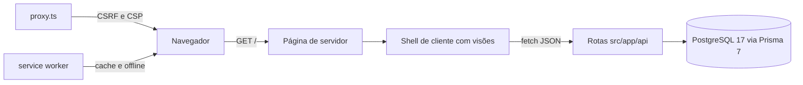
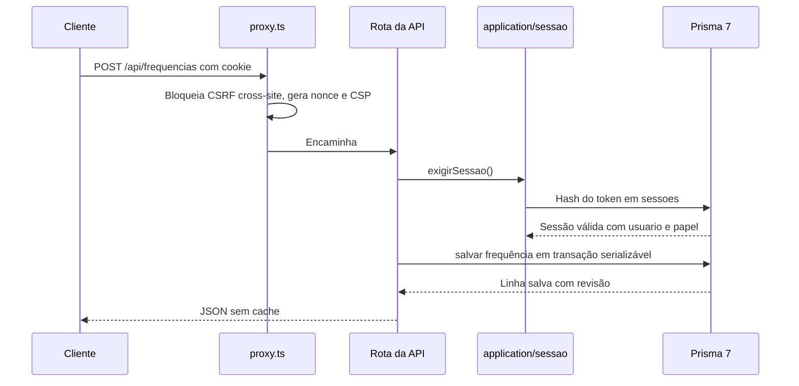

# Arquitetura

Next.js 16 (App Router) com TypeScript estrito sobre PostgreSQL 17 via Prisma 7 (adaptador `pg`). A aplicação é um único processo Node que serve a página do aplicativo, as rotas de API e o service worker. A coordenação registra uma frequência por turma e dia, compartilhada pela equipe, e a administração cuida das contas e dos cadastros.

## Visão geral

O navegador carrega `src/app/page.tsx`, um componente de servidor que resolve a sessão e pré-busca o escopo do usuário: séries, turmas visíveis, alunos e frequências do mês corrente. Sem sessão, a tela de entrada é renderizada no mesmo endereço. Com sessão e a capacidade `operar`, a página entrega ao shell de cliente o que cada papel pode ver; o diretor de turma, que só tem `verEstatisticasDasTurmas`, recebe a tela própria de `src/components/diretor/` com o contexto dos vínculos vigentes, e qualquer outra sessão volta à entrada; a partir daí o shell troca de visão localmente, sem recarregar, e as ações chamam rotas em `src/app/api/**`, que resolvem a sessão, aplicam as guardas de papel e respondem JSON. O service worker em `public/sw.js` cuida da instalação como PWA e da página de aviso quando a internet cai.


```mermaid
flowchart LR
  N[Navegador] -->|GET /| P[Página de servidor]
  P --> S[Shell de cliente com visões]
  S -->|fetch JSON| A[Rotas src/app/api]
  A --> D[(PostgreSQL 17 via Prisma 7)]
  M[proxy.ts] -->|CSRF e CSP| N
  W[service worker] -->|cache e offline| N
```

## Camadas

- `src/domain/`: regras puras, sem dependência de framework ou banco. `frequencia.ts` traz os tipos de série, turma, aula, aluno e frequência, a validação de calendário e de horário, a derivação da marca do aluno no dia e a montagem da grade por turma de origem; `usuarios.ts` traz a política de senha, os papéis e os rótulos de exibição. Tudo aqui é testável de forma isolada e é compartilhado entre servidor e cliente.
- `src/application/`: casos de uso. `frequencias.ts` carrega, lista e salva a frequência compartilhada com o controle de revisão em transação serializável; `alunos.ts`, `series.ts`, `turmas.ts`, `horarios.ts` e `usuarios.ts` gerenciam as entidades escolares e as contas; `sessao.ts` autentica, resolve a identidade e troca a própria senha. Validação de entrada com zod, decisões de negócio e mapeamento das linhas de banco para os tipos do domínio.
- `src/infra/`: integrações. `banco.ts` é o singleton do PrismaClient com o adaptador `pg`; `ambiente.ts` valida as variáveis com falha antecipada; `auth/` concentra hash de senha, sessões opacas e limitador de tentativas; `transacoes.ts` executa transações ACID com repetição automática; `erros.ts` traduz qualquer exceção para português claro; `http.ts` reúne os auxiliares comuns das rotas; `auditoria.ts` registra as ações administrativas.
- `src/app/` e `src/components/`: apresentação. A página única, as rotas de API como adaptadores finos dos casos de uso e os componentes de interface, com o conjunto shadcn/ui personalizado em `components/ui`, as animações com Motion e o registro da PWA.

A dependência aponta para dentro: apresentação chama aplicação, aplicação orquestra domínio e infraestrutura, domínio não importa nada. A infraestrutura conhece o Prisma; a aplicação não conhece HTTP.

## Fluxo de uma requisição autenticada


```mermaid
sequenceDiagram
  participant C as Cliente
  participant X as proxy.ts
  participant R as Rota da API
  participant U as application/sessao
  participant B as Prisma 7
  C->>X: POST /api/frequencias com cookie
  X->>X: Bloqueia CSRF cross-site, gera nonce e CSP
  X->>R: Encaminha
  R->>U: exigirSessao()
  U->>B: Hash do token em sessoes
  B-->>U: Sessão válida com usuario e papel
  R->>B: salvar frequência em transação serializável
  B-->>R: Linha salva com revisão
  R-->>C: JSON sem cache
```

## Concorrência da frequência (ACID)

Uma frequência existe por (turma, dia), garantida por restrição única no banco. O salvamento inteiro roda dentro de uma transação interativa com isolamento `Serializable`: a validação das faltas contra a lista atual de alunos e das aulas contra a grade da turma, a criação ou atualização da revisão e a troca das faltas acontecem juntas, ou nada acontece. Conflitos de serialização (P2034) são refeitos automaticamente até três vezes com pausa crescente; ao fim, o caminho converte o empate em conflito 409 com a versão vigente, nunca em sobrescrita.

- `revisao 0` cria a primeira versão; se a frequência já existe, a API responde 409 com a versão vigente.
- `revisao N` atualiza apenas se a versão vigente for exatamente N, com incremento atômico; em caso de divergência, responde 409 com a versão vigente.

O cliente mantém rascunho em sessionStorage enquanto houver marcações não salvas, e o 409 preserva as marcações locais oferecendo a recarga da versão salva. Assim, duas pessoas da coordenação nunca sobrescrevem a mesma chamada sem aviso.

## Chamada Parcial e confirmação manual

`frequencia-parcial.ts` define a presença personalizada por dia inteiro, turno ou aulas. O caso de uso correspondente guarda uma linha por aluno e dia, com nomes históricos e revisão otimista. Salvamento, confirmação manual da Seduc e exclusão rodam em transação serializável; revisão obsoleta responde 409. A revisão aumenta quando o conteúdo ou a confirmação muda. Corrigir conteúdo limpa data, responsável e chave da confirmação.

`frequencia-personalizada.ts` compõe a lista efetiva da Chamada Parcial sem escrever dados. Personalizações têm prioridade por aluno e dia; os demais registros vêm da lista histórica da chamada salva. Se houver mais de uma chamada do aluno no dia, a mais recentemente atualizada define a base. O filtro de turma é aplicado depois da composição, evitando reapresentar a base de um aluno já personalizado em outra turma. P corresponde a Dia inteiro e F, FJ e S preservam a situação diária. Sem chamada salva, nenhuma presença é presumida.

A confirmação da base usa as revisões da chamada e de `alunos_chamada`; personalizações usam a própria revisão. A API recusa confirmar a base quando já existe ajuste ou outra chamada passou a defini-la. Ao criar um ajuste com `baseChamada`, confere revisão e participação do aluno e conserva a turma de origem do registro, inclusive após transferência. Remover o ajuste limpa as confirmações da base do aluno naquele dia antes de voltar a apresentá-la. As faltas, a revisão e os indicadores da chamada normal permanecem independentes.

A confirmação representa o lançamento feito pela equipe no sistema externo. Não há chamada à API da Seduc. A terceira integração Google, finalidade `PARCIAL`, recebe uma aba própria em arquivo distinto dos arquivos de frequência e saídas. A prévia vincula dados locais e estrutura externa; envio manual usa a lista efetiva e acrescenta registros novos. O código `chamada:<alunoId>:<dia>` mantém a identidade ao personalizar ou retornar à base; UUIDs antigos reconhecidos são preservados. A opção explícita de atualizar existentes restringe alterações a linhas identificadas e marcadas pela integração, com nova conferência de valores e fórmulas.

O envio da planilha parcial usa exclusão distribuída por `pg_try_advisory_xact_lock` em uma conexão dedicada ao PostgreSQL de runtime (`DATABASE_URL`). A trava é obtida antes de remontar o plano e cobre releitura e escrita. Se estiver ocupada, a operação responde 409; perder a conexão da trava cancela a requisição HTTP e retorna 502, pedindo conferência do resultado. A operação com efeito externo não entra na retentativa automática de transações. Essa trava não torna PostgreSQL e Google atômicos nem desfaz um lote já aceito. Frequência, saídas e entradas mantêm sua fila de envio em memória; a exclusão distribuída desta etapa atende somente a planilha parcial.

A cópia JSON permanece na versão 1 e acrescenta `frequenciasParciais` opcional. A restauração mantém registros existentes por identidade ou aluno e dia, conta divergências e preserva histórico. Conexões Google não fazem parte da cópia. Decisão na [ADR-034](adr/034-chamada-parcial-e-confirmacao-seduc.md).

## Página única com visões locais

O aplicativo inteiro vive em `/`, com as visões trocadas no cliente: Painel, Chamada, Chamada Parcial, Saídas e entradas e Relatórios para a equipe; Alunos (consulta) para a coordenação; Gestão para a administração. A troca replica o fluxo do aplicativo original e o comportamento de app instalável em tela cheia. A tela de entrada usa o mesmo endereço quando não há sessão, e o `router.refresh()` reexecuta o componente de servidor após entrar ou sair. Não há navegação entre rotas de página: toda troca de contexto é local, o que mantém a rolagem e o estado da chamada em aberto. Valores antigos de `?visao=` continuam abrindo a área correspondente.

## Organização de diretórios

```
src/
  app/
    api/                    rotas HTTP (adaptadores finos dos casos de uso)
      auth/                 entrar, sair e sessão corrente
      conta/                troca da própria senha
      alunos/               listagem e CRUD do administrador
      series/               CRUD de séries
      turmas/               listagem e CRUD do administrador
      horarios/             aulas da turma: listagem, criação, edição e exclusão
      usuarios/             gestão de contas pelo administrador
      responsaveis/         equipe ativa que pode liberar saídas
      frequencias-personalizadas/ base diária e personalizações efetivas para a Seduc
      frequencias-parciais/ personalizações, revisão e confirmação manual da Seduc
      planilha-parcial/     terceira planilha: configuração, preparação, prévia e envio
      planilha/fila/       fila de envios automáticos: estado, processar, agenda, reenfileirar e descartar
      frequencias/          consulta por dia, período ou mês, salvamento e resumo acumulado
      saidas/               registro, consulta e remoção de saídas antecipadas
      configuracoes/        leitura e atualização dos recursos da escola
      justificativas/       catálogo de justificativas: leitura e gestão
      planilha/             integração com Google Planilhas: estado, token, estrutura, envio, modo e cópias
      backup/               exportação e importação da cópia JSON
      saude/                verificação de saúde
    page.tsx                página única: sessão, pré-busca e shell
    error.tsx               fronteira de erro amigável
    not-found.tsx           404
    icon.svg                ícone do aplicativo
    layout.tsx              metadados, manifest da PWA e fontes
  components/
    aplicacao.tsx           shell com visões e navegação inferior
    auth/                   tela de entrada
    painel/                 indicadores do dia com gráficos
    frequencia/             vista da chamada diária
    frequencia-parcial/     vista e formulários da presença parcial
    saidas/                 registro e relatórios das saídas antecipadas
    relatorios/             sub-abas de histórico, grade e por aluno
    historico/              vista do histórico
    grade/                  grade por turma de origem com modos de período
    alunos/                 lista de consulta da coordenação
    gestao/                 área do administrador (abas, diálogos e configurações)
    conta/                  diálogo de troca de senha
    pwa/                    registro do service worker e avisos
    ui/                     conjunto shadcn/ui personalizado
  domain/
    frequencia-parcial.ts   tipos e rótulos da presença personalizada
    frequencia-personalizada.ts   contrato da base diária e dos ajustes
    planilha-parcial.ts     planejamento da terceira planilha
    fila-planilha.ts        regras puras da fila FIFO: ordem, esperas, reserva e desfecho
    frequencia.ts           regras puras de frequência, justificativas e saídas
    relatorios.ts           indicadores e relatórios derivados
    planilha.ts             dataframe, esquema da planilha, CSV e planejamento conservador
    usuarios.ts             política de senha, papéis e rótulos
  application/
    frequencia-parcial.ts   salvar, consultar, confirmar e remover com revisão
    frequencia-personalizada.ts   compor a base diária com os ajustes existentes
    planilha-parcial.ts     preparar a aba, simular e enviar registros parciais
    fila-planilha.ts        fila FIFO durável dos envios automáticos às planilhas (ADR-039)
    frequencias.ts          carregar, listar, salvar e resumir o acumulado
    saidas.ts               registrar, listar e remover saídas antecipadas
    configuracoes.ts        ler e atualizar os recursos da escola
    justificativas.ts       ler e gerenciar o catálogo de justificativas
    planilha.ts             integração com Google Planilhas: esquema, envio, modo completo e cópias
    backup.ts               exportar e importar a cópia JSON
    alunos.ts               listar e gerenciar alunos
    series.ts               listar e gerenciar séries
    turmas.ts               listar, criar, editar e excluir turmas com aula padrão
    horarios.ts             aulas da turma: criar, editar, desativar e excluir
    usuarios.ts             gestão de contas e papéis
    sessao.ts               entrada, saída, identidade e senha
  infra/
    ambiente.ts             validação de variáveis com zod
    banco.ts                singleton do PrismaClient com adaptador pg
    http.ts                 json, guardas de sessão e papel, corpo
    erros.ts                tradução de exceções para português
    transacoes.ts           transações ACID com repetição
    auditoria.ts            trilha de ações administrativas
    planilha-erros.ts       diagnóstico limitado dos erros de integração
    auth/
      hash.ts               scrypt de senhas
      sessao.ts             sessões opacas em cookie HttpOnly
      limite.ts             limitador de tentativas em memória
  proxy.ts                  CSRF, CSP com nonce e cabeçalhos
prisma/                     schema e migrações
prisma.config.ts            configuração do CLI do Prisma 7
generated/                  cliente Prisma gerado (fora do git)
public/                     manifest, service worker, offline e ícones
docker/                     entrypoint e migrador do contêiner
scripts/                    criar-admin, criar-coordenacao e seed
docs/                       esta documentação
tests/                      Vitest (unidade e contratos)
```

## Decisões registradas

- [ADR-001: PostgreSQL via connection string com Prisma](adr/001-postgresql-com-prisma.md)
- [ADR-002: sessões opacas em cookie HttpOnly](adr/002-sessoes-opacas.md)
- [ADR-003: faltas normalizadas, presença implícita](adr/003-faltas-normalizadas.md)
- [ADR-004: página única com visões locais](adr/004-pagina-unica.md)
- [ADR-005: autenticação própria sem cadastro público](adr/005-autenticacao-propria.md)
- [ADR-006: papéis de administração e coordenação com gestão central](adr/006-papeis-e-gestao.md)
- [ADR-007: transações serializáveis com repetição automática](adr/007-transacoes-acid.md)
- [ADR-008: PWA com service worker próprio](adr/008-pwa.md)
- [ADR-009: erros de banco traduzidos para português claro](adr/009-erros-amigaveis.md)
- [ADR-010: frequência única por turma e dia com faltas por aula](adr/010-frequencia-unica-com-aulas.md)
- [ADR-011: lembrar o login no dispositivo](adr/011-lembrar-login.md)
- [ADR-012: chamada diária com faltas justificadas, saídas antecipadas e recursos opcionais](adr/012-chamada-diaria-com-saidas.md)
- [ADR-013: grade por período e cópia de segurança em JSON](adr/013-grade-por-periodo-e-copia-json.md)
- [ADR-014: catálogo de justificativas configurável](adr/014-justificativas-configuraveis.md)
- [ADR-015: exportação CSV da grade por turma de origem](adr/015-exportacao-csv-da-grade.md)
- [ADR-016: integração opcional com Google Planilhas](adr/016-integracao-opcional-com-google-planilhas.md)
- [ADR-017: modo completo com destrave, prazo e cópias](adr/017-modo-completo-com-copias.md)
- [ADR-018: texto opcional na saída durante a aula](adr/018-texto-na-saida-durante-a-aula.md)
- [ADR-019: integração de saídas antecipadas com Google Planilhas](adr/019-integracao-de-saidas-com-google-planilhas.md)
- [ADR-020: justificativa escrita e catálogo de quem libera a saída](adr/020-justificativa-escrita-e-catalogo-de-liberadores.md)

- [ADR-034: Chamada Parcial e confirmação manual da Seduc](adr/034-chamada-parcial-e-confirmacao-seduc.md)
